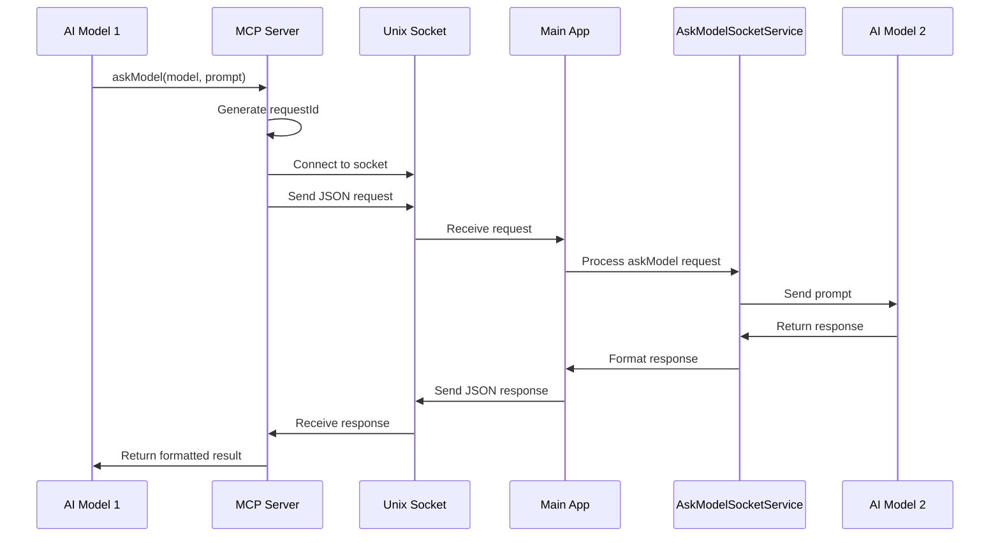

# Cross-Provider MCP Documentation

## Overview

The Cross-Provider MCP (Model Context Protocol) system enables AI models to consult each other through the `askModel` tool. This document explains how the `mcp-crossprovider-server.cjs` works to facilitate AI-to-AI communication between Claude and Gemini.

## Architecture

### Core Components

1. **MCP Cross-Provider Server** (`src/services/providers/claude/mcp-crossprovider-server.cjs`)

   - Node.js MCP server implementing the `askModel` tool
   - Communicates via Unix domain sockets with the main application
   - Handles model-to-model consultation requests

2. **AskModelSocketService** (`src/services/core/AskModelSocketService.ts`)

   - Main application service that creates and manages socket connections
   - Routes askModel requests to appropriate providers
   - Handles the actual AI consultation logic

3. **Socket Communication**
   - Unix domain socket at `/tmp/mcp-askmodel-[sessionId].sock`
   - Bidirectional communication between MCP server and main app
   - JSON-based message protocol

## How It Works

### 1. Tool Registration

The MCP server registers the `askModel` tool with the following schema:

```javascript
{
  name: "askModel",
  description: "Consult another AI model for collaborative problem-solving",
  inputSchema: {
    type: "object",
    properties: {
      model: {
        type: "string",
        enum: ["claude", "gemini"],
        description: "The AI model to consult. You can not consult yourself."
      },
      prompt: {
        type: "string",
        description: "The question or topic to discuss with the other model..."
      },
      sessionTag: {
        type: "string",
        description: "The session tag to use for context (optional)"
      }
    },
    required: ["model", "prompt"]
  }
}
```

### 2. Request Flow



### 3. Implementation Details

#### Request Structure

```javascript
// Request sent from MCP server to main app
{
  requestId: "askmodel_1234567890_abc123",
  model: "gemini",  // or "claude"
  prompt: "Can you help me understand...",
  sessionTag: "my-session", // optional
  timestamp: "2024-01-01T12:00:00.000Z"
}

// Response sent back from main app
{
  requestId: "askmodel_1234567890_abc123",
  text: "Here's my analysis of your question...",
  error: null // or error message if failed
}
```

#### Socket Communication

The MCP server creates a socket connection for each request:

```javascript
async sendAskModelRequest(request) {
  return new Promise((resolve, reject) => {
    // Store resolver for this request
    this.pendingRequests.set(request.requestId, { resolve, reject });

    // Connect to main app socket
    const client = net.createConnection(this.socketPath, () => {
      // Send the request
      client.write(JSON.stringify(request));
    });

    client.on("data", (data) => {
      const response = JSON.parse(data.toString());
      if (response.requestId === request.requestId) {
        resolve(response);
        client.end();
      }
    });
  });
}
```

#### Session Tag Handling

For Claude consultations, the server handles session tags intelligently:

1. Uses explicitly provided `sessionTag` if available
2. Falls back to `SESSION_ID` environment variable
3. For "default" sessions, finds the most recent session tag from `.nexus/claude-ref/` directory

```javascript
// Session tag resolution logic
if (sessionTag === "default") {
  // Find most recent session tag from ref files
  const refFiles = await fs.promises.readdir(refDir);
  const taggedFiles = refFiles.filter((f) => f.startsWith("tagged-") && f.endsWith(".ref"));

  // Use the most recently modified file's tag
  sessionTag = getMostRecentTag(taggedFiles);
}
```

## Main App Integration

### AskModelSocketService

The main application service that handles incoming askModel requests:

```typescript
class AskModelSocketService {
  private socketServer: net.Server;
  private sessionId: string;

  async initialize(sessionId: string): Promise<void> {
    this.sessionId = sessionId;
    const socketPath = `/tmp/mcp-askmodel-${sessionId}.sock`;

    // Create socket server
    this.socketServer = net.createServer((connection) => {
      this.handleConnection(connection);
    });

    // Start listening
    await this.socketServer.listen(socketPath);
  }

  private async handleConnection(connection: net.Socket): Promise<void> {
    connection.on("data", async (data) => {
      const request = JSON.parse(data.toString());

      try {
        // Route to appropriate provider
        const response = await this.processAskModelRequest(request);
        connection.write(JSON.stringify(response));
      } catch (error) {
        connection.write(
          JSON.stringify({
            requestId: request.requestId,
            error: error.message,
          })
        );
      }
    });
  }

  private async processAskModelRequest(request: any): Promise<any> {
    const { model, prompt, sessionTag } = request;

    if (model === "claude") {
      // Use Claude provider to get response
      const response = await this.claudeProvider.sendMessage(prompt);
      return {
        requestId: request.requestId,
        text: response,
      };
    } else if (model === "gemini") {
      // Use Gemini provider to get response
      const response = await this.geminiProvider.sendMessage(prompt);
      return {
        requestId: request.requestId,
        text: response,
      };
    }
  }
}
```

## Use Cases

### 1. Claude Consulting Gemini

When Claude needs Gemini's perspective:

```typescript
// Claude's request
await askModel({
  model: "gemini",
  prompt: "I'm analyzing a complex data structure. Can you suggest efficient algorithms for traversing nested objects?",
});
```

### 2. Gemini Consulting Claude

When Gemini needs Claude's analysis:

```typescript
// Gemini's request
await askModel({
  model: "claude",
  prompt:
    "I need help understanding the security implications of this code pattern. What vulnerabilities should I consider?",
});
```

### 3. Context-Aware Consultation

Using session tags for context continuity:

```typescript
// Consultation with specific context
await askModel({
  model: "claude",
  prompt:
    "Given our previous discussion about the authentication system, how would you implement role-based access control?",
  sessionTag: "auth-system-design",
});
```

## Error Handling

The system handles various error scenarios:

1. **Socket Connection Errors**

   - Automatically retries connection
   - Returns descriptive error messages
   - Falls back gracefully

2. **Provider Unavailability**

   - Checks if target provider is initialized
   - Returns helpful error messages
   - Suggests troubleshooting steps

3. **Timeout Handling**
   - Socket operations have timeouts
   - Pending requests are cleaned up
   - Clear timeout messages returned

```javascript
// Error response example
{
  content: [
    {
      type: "text",
      text: "I encountered an error while trying to consult Gemini: Socket connection failed: ECONNREFUSED\n\nPlease ensure Gemini is properly initialized and available.",
    },
  ],
}
```

## Security Considerations

1. **Unix Domain Sockets**

   - Local-only communication (no network exposure)
   - File system permissions restrict access
   - Unique socket paths per session

2. **Request Validation**

   - Model names are validated against allowed list
   - Request IDs prevent response mixing
   - JSON parsing errors are handled safely

3. **Session Isolation**
   - Each session has its own socket
   - No cross-session data leakage
   - Clean socket lifecycle management

## Configuration

The MCP server is configured through environment variables:

```bash
# Set by the main application when spawning MCP server
SESSION_ID=my-session-123
PERMISSION_MODE=default
```

Socket paths follow the pattern:

```
/tmp/mcp-askmodel-[sessionId].sock
```

## Testing

To test the askModel functionality:

```javascript
// Test askModel request
describe("askModel MCP Server", () => {
  it("should handle Gemini consultation", async () => {
    const server = new AskModelServer();
    await server.start();

    const response = await server.consultGeminiDirect("What's the best sorting algorithm for small datasets?");

    expect(response.content[0].text).toContain("sorting");
  });

  it("should handle socket errors gracefully", async () => {
    // Simulate socket unavailable
    const response = await server.sendAskModelRequest({
      requestId: "test-123",
      model: "gemini",
      prompt: "test",
    });

    expect(response.content[0].text).toContain("error");
  });
});
```

## Limitations

1. **One-way Communication**: Each consultation is a single request-response (no conversation threads)
2. **No Streaming**: Responses are returned as complete text (no incremental updates)
3. **Session Context**: Only the previous session context is available to consulted model (sync happens after each conversation)
4. **Self-Consultation**: Models cannot consult themselves (Claude can't ask Claude)

## Future Enhancements

Potential improvements to the cross-provider consultation system:

1. **Streaming Responses**: Support for incremental response streaming
2. **Conversation Threads**: Multi-turn consultations with context
3. **Tool Sharing**: Allow consulted model to use tools during consultation
4. **Response Caching**: Cache frequent consultations for performance
