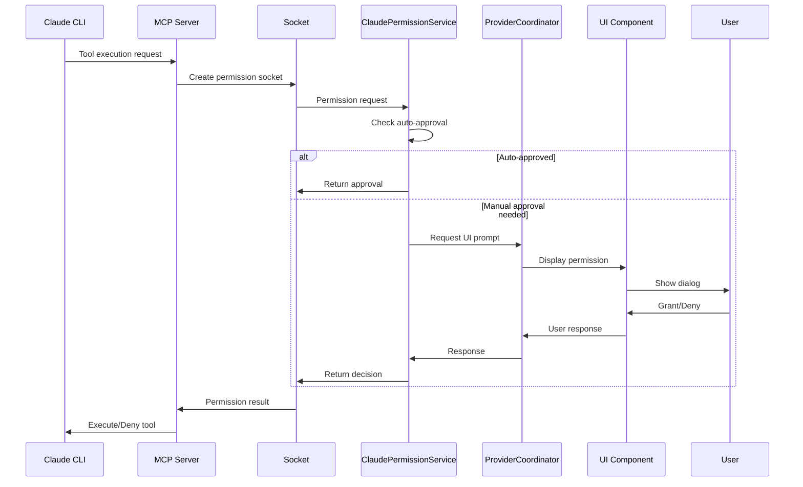
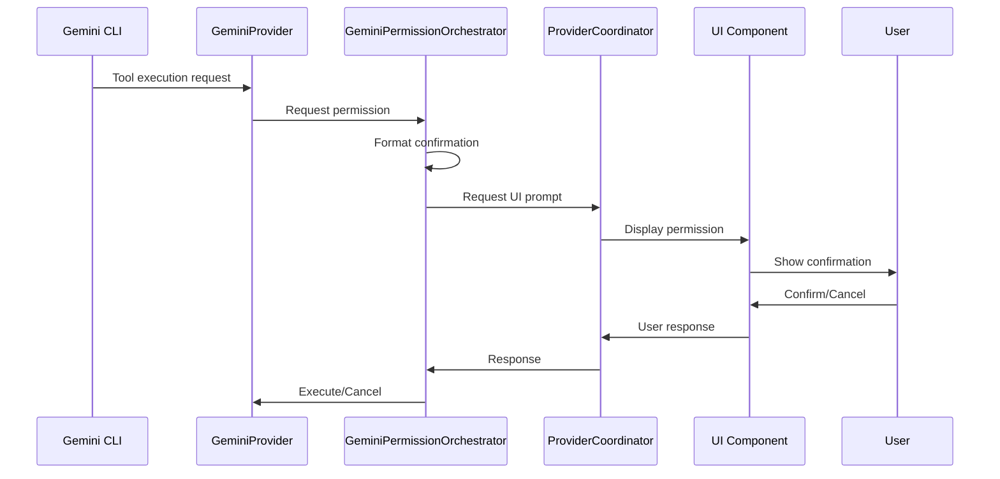

# Permission System Documentation

## Overview

The Nexus CLI implements a distributed permission system that handles permission requests from both Claude and Gemini providers. This document explains how the permission flow works internally.

## Architecture

### Key Components

1. **ProviderPermissionCoordinator** (`src/services/permissions/ProviderPermissionCoordinator.ts`)

   - Unified entry point for all permission requests
   - Routes requests to appropriate provider-specific handlers
   - Manages pending permissions and UI integration

2. **Provider-Specific Services**

   **Claude:**

   - `ClaudePermissionService` (`src/services/providers/claude/services/ClaudePermissionService.ts`)
     - Handles Claude's built-in permission modes
     - Integrates with MCP permission server
     - Auto-approves tools based on mode and category
   - `ClaudePermissionOrchestrator` (`src/services/permissions/ClaudePermissionOrchestrator.ts`)
     - Orchestrates Claude permission workflow
     - Manages socket communication

   **Gemini:**

   - `GeminiPermissionOrchestrator` (`src/services/permissions/GeminiPermissionOrchestrator.ts`)
     - Implements custom permission wrapper for Gemini
     - Creates user-friendly confirmation prompts
     - No auto-approval support

3. **MCP Permission Server** (`src/services/providers/claude/mcp-permission-server.cjs`)
   - Handles permission requests via MCP protocol
   - Creates Unix domain sockets for IPC
   - Bridges MCP tools to permission system

## Permission Flow

### 1. Claude Permission Flow



**Implementation Details:**

```typescript
// Claude permission modes and auto-approval logic
class ClaudePermissionService {
  private permissionMode: PermissionMode = "DEFAULT";

  async processPermissionRequest(request: PermissionRequest): Promise<PermissionResponse> {
    const { tool_name, arguments: toolArgs } = request;

    // Check if auto-approval applies
    if (!this.shouldShowPermissionPrompt(tool_name, this.permissionMode)) {
      return {
        approved: true,
        autoApproved: true,
        tier: getToolTier(tool_name),
      };
    }

    // Create socket for UI communication
    const socketPath = await this.createPermissionSocket();

    // Request permission through UI
    const response = await this.requestPermissionViaSocket(tool_name, toolArgs, socketPath);

    return {
      approved: response.granted,
      autoApproved: false,
      tier: getToolTier(tool_name),
    };
  }

  private shouldShowPermissionPrompt(toolName: string, mode: PermissionMode): boolean {
    const tier = getToolTier(toolName);

    switch (mode) {
      case "BYPASS_PERMISSIONS":
        return false; // Auto-approve everything
      case "PLAN":
      case "ACCEPT_EDITS":
      case "YOLO":
        // Auto-approve edits, prompt for other dangerous tools
        return tier === "dangerous" && !this.isEditTool(toolName);
      case "CAUTIOUS":
        return tier !== "safe";
      case "DEFAULT":
      default:
        return tier === "cautious" || tier === "dangerous";
    }
  }
}
```

### 2. Gemini Permission Flow



**Implementation Details:**

```typescript
// Gemini permission orchestrator - no auto-approval
class GeminiPermissionOrchestrator {
  async handleToolConfirmation(tool: ToolDetails, callback: (confirmed: boolean) => void): Promise<void> {
    // Create user-friendly confirmation details
    const confirmationDetails = this.createConfirmationDetails(tool);

    // Always show permission prompt for Gemini
    const permissionRequest: PermissionRequest = {
      id: crypto.randomUUID(),
      provider: "gemini",
      type: "tool_confirmation",
      details: confirmationDetails,
      callback,
    };

    // Send to coordinator for UI handling
    await this.coordinator.requestPermission(permissionRequest);
  }

  private createConfirmationDetails(tool: ToolDetails): ConfirmationDetails {
    const { type, name, args } = tool;

    switch (type) {
      case "edit":
        return {
          title: "File Edit Request",
          description: `Edit file: ${args.path}`,
          action: "edit",
          details: { path: args.path, changes: args.changes },
        };

      case "exec":
        return {
          title: "Command Execution Request",
          description: `Run command: ${args.command}`,
          action: "execute",
          details: { command: args.command, args: args.args },
        };

      default:
        return {
          title: "Tool Request",
          description: `Execute ${name}`,
          action: "execute",
          details: args,
        };
    }
  }
}
```

## Permission Categories

### Tool Classification

```typescript
// Tool tier definitions
type ToolTier = "safe" | "cautious" | "dangerous";

// Tool categorization utilities
function getToolTier(toolName: string): ToolTier {
  const safeTools = ["read_file", "list_files", "search_files", "get_weather", "calculate"];

  const dangerousTools = ["write_file", "execute_command", "delete_file", "edit_file", "create_file"];

  if (safeTools.includes(toolName)) return "safe";
  if (dangerousTools.includes(toolName)) return "dangerous";
  return "cautious";
}

// Special categories for Claude
class ClaudeToolCategories {
  static readonly SAFE_TOOLS = new Set(["read_file", "view_image", "list_files", "search_files"]);

  static readonly EDIT_TOOLS = new Set([
    "str_replace_editor",
    "str_replace_based_edit_tool",
    "edit_file",
    "create_file",
  ]);

  static readonly RESTRICTED_TOOLS = new Set(["execute_bash", "delete_file", "move_file"]);

  static isEditTool(toolName: string): boolean {
    return this.EDIT_TOOLS.has(toolName);
  }
}
```

### Permission Modes (Claude Only)

```typescript
type PermissionMode =
  | "DEFAULT" // Prompt for cautious and dangerous
  | "CAUTIOUS" // More restrictive prompting
  | "YOLO" // Auto-approve file edits (Gemini compatibility)
  | "PLAN" // Enhanced planning with Auto Opus
  | "ACCEPT_EDITS" // Auto-approve file modifications
  | "BYPASS_PERMISSIONS"; // Auto-approve all operations

// Mode configuration per provider
interface ProviderPermissionConfig {
  claude: {
    modes: PermissionMode[];
    defaultMode: "DEFAULT";
    supportsAutoApproval: true;
  };
  gemini: {
    modes: ["DEFAULT"]; // Only manual approval
    defaultMode: "DEFAULT";
    supportsAutoApproval: false;
  };
}
```

## Socket Communication

### Unix Domain Socket for Permissions

```typescript
// Socket manager for IPC
class MCPSocketManager {
  private activeSockets = new Map<string, net.Server>();

  async createPermissionSocket(sessionId: string): Promise<string> {
    const socketPath = `/tmp/mcp-permission-${sessionId}-${Date.now()}.sock`;

    // Remove existing socket file
    try {
      await fs.unlink(socketPath);
    } catch {}

    // Create new socket server
    const server = net.createServer((connection) => {
      this.handlePermissionConnection(connection, sessionId);
    });

    // Listen on socket
    await new Promise<void>((resolve, reject) => {
      server.listen(socketPath, resolve);
      server.once("error", reject);
    });

    this.activeSockets.set(sessionId, server);
    return socketPath;
  }

  private handlePermissionConnection(connection: net.Socket, sessionId: string): void {
    connection.on("data", async (data) => {
      const request = JSON.parse(data.toString());

      // Process permission request
      const response = await this.processPermissionRequest(request, sessionId);

      // Send response
      connection.write(JSON.stringify(response));
      connection.end();
    });
  }
}
```

## UI Integration

The permission UI is built with React and Ink:

```typescript
// Permission prompt component
export const PermissionPrompt: React.FC<{
  request: PendingPermission;
  onResponse: (granted: boolean) => void;
}> = ({ request, onResponse }) => {
  const { provider, details } = request;

  return (
    <Box flexDirection="column" borderStyle="round" borderColor="yellow">
      <Box marginBottom={1}>
        <Text color="yellow" bold>
          ⚠️ Permission Request from {provider}
        </Text>
      </Box>

      <Box flexDirection="column" marginX={1}>
        <Text>{details.title}</Text>
        <Text dim>{details.description}</Text>

        {details.details && (
          <Box marginTop={1}>
            <Text dim>Details:</Text>
            <Text>{JSON.stringify(details.details, null, 2)}</Text>
          </Box>
        )}
      </Box>

      <Box marginTop={1} justifyContent="center">
        <Text>
          <Text color="green">[Y]es</Text>
          {" / "}
          <Text color="red">[N]o</Text>
          {" / "}
          <Text color="blue">[A]lways</Text>
          {" / "}
          <Text color="magenta">N[e]ver</Text>
        </Text>
      </Box>
    </Box>
  );
};
```

## Event Flow

```typescript
// Central event bus integration
class ProviderPermissionCoordinator {
  private pendingPermissions = new Map<string, PendingPermission>();

  async requestPermission(request: PermissionRequest): Promise<void> {
    const pending: PendingPermission = {
      ...request,
      timestamp: Date.now(),
    };

    this.pendingPermissions.set(request.id, pending);

    // Emit event for UI to handle
    this.eventBus.emit("permission:request", pending);

    // Set timeout for auto-deny
    setTimeout(() => {
      if (this.pendingPermissions.has(request.id)) {
        this.handleResponse(request.id, false);
        this.logger.warn(`Permission request ${request.id} timed out`);
      }
    }, 30000); // 30 second timeout
  }

  handleResponse(requestId: string, granted: boolean): void {
    const pending = this.pendingPermissions.get(requestId);
    if (!pending) return;

    // Execute callback
    pending.callback(granted);

    // Clean up
    this.pendingPermissions.delete(requestId);

    // Log decision
    this.logger.info("Permission decision", {
      requestId,
      provider: pending.provider,
      granted,
      tool: pending.details.title,
    });
  }
}
```

## Security Considerations

1. **No Automatic Grants by Default**: Both providers start in DEFAULT mode requiring explicit approval
2. **Socket File Permissions**: Unix sockets are created with restricted permissions (0600)
3. **Request Validation**: All permission requests are validated for structure and content
4. **Timeout Handling**: Unanswered permission requests auto-deny after 30 seconds
5. **Audit Trail**: All permission decisions are logged with full context

## Testing

```typescript
describe("Permission System", () => {
  describe("ClaudePermissionService", () => {
    it("should auto-approve safe tools in DEFAULT mode", async () => {
      const service = new ClaudePermissionService();
      service.setPermissionMode("DEFAULT");

      const result = await service.processPermissionRequest({
        tool_name: "read_file",
        arguments: { path: "/tmp/test.txt" },
      });

      expect(result.approved).toBe(true);
      expect(result.autoApproved).toBe(true);
    });

    it("should prompt for dangerous tools in ACCEPT_EDITS mode", async () => {
      const service = new ClaudePermissionService();
      service.setPermissionMode("ACCEPT_EDITS");

      const result = await service.processPermissionRequest({
        tool_name: "execute_bash",
        arguments: { command: "rm -rf /" },
      });

      // Should require manual approval
      expect(result.autoApproved).toBe(false);
    });
  });

  describe("GeminiPermissionOrchestrator", () => {
    it("should always require manual approval", async () => {
      const orchestrator = new GeminiPermissionOrchestrator();
      let callbackCalled = false;

      await orchestrator.handleToolConfirmation(
        {
          type: "edit",
          name: "edit_file",
          args: { path: "/tmp/test.txt" },
        },
        (confirmed) => {
          callbackCalled = true;
        }
      );

      // Should have requested UI prompt
      expect(callbackCalled).toBe(false); // Waiting for user
    });
  });
});
```

## Configuration

Permission behavior is configured per provider:

```json
{
  "providers": {
    "claude": {
      "permissionMode": "DEFAULT",
      "autoApprovalEnabled": true,
      "permissionTimeout": 30000
    },
    "gemini": {
      "permissionMode": "DEFAULT",
      "autoApprovalEnabled": false,
      "permissionTimeout": 30000
    }
  },
  "permissions": {
    "socketDir": "/tmp",
    "socketCleanupInterval": 60000,
    "logPermissions": true
  }
}
```
