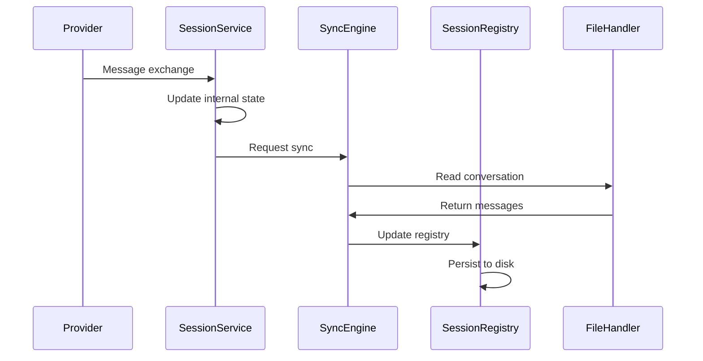
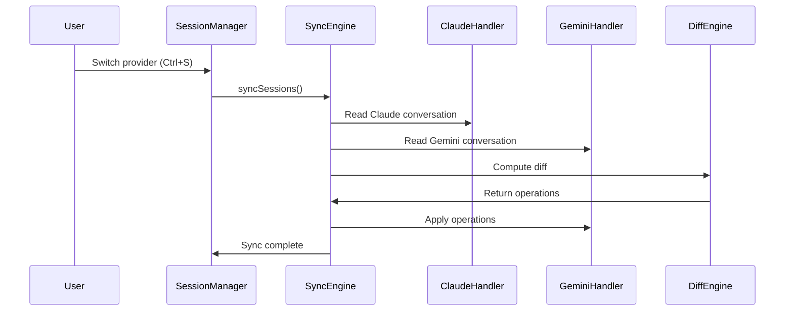

# Session Memory Sync Documentation

## Overview

The Session Memory Sync system enables seamless context preservation when switching between Claude and Gemini providers. This document explains the internal architecture and data flow of the synchronization mechanism.

## Architecture

### Core Components

1. **SyncEngine** (`src/services/sync/core/SyncEngine.ts`)
   - Orchestrates the synchronization process
   - Manages sync strategies and state persistence
   - Implements `ISyncEngine` interface

2. **SessionManager** (`src/services/session/SessionManager.ts`)
   - Central session lifecycle management
   - Coordinates provider sessions
   - Handles session creation and switching

3. **SessionRegistryManager** (`src/services/sync/registry/SessionRegistry.ts`)
   - Maintains cross-provider session registry
   - Tracks session metadata and sync status
   - Persists to `.nexus/sessions.json`

4. **Provider Session Services**
   - Claude: `ClaudeSessionService` (`src/services/providers/claude/services/ClaudeSessionService.ts`)
   - Gemini: `GeminiSessionService` (`src/services/providers/gemini/services/GeminiSessionService.ts`)
   - Each implements provider-specific session management

5. **File Handlers**
   - `ClaudeFileHandler` - Manages Claude's file-based sessions
   - `GeminiFileHandler` - Handles Gemini backup files for sync

## Memory Sync Flow

### 1. Data Capture Phase



**Implementation:**

```typescript
// Provider-specific session states
interface ClaudeSessionState {
  currentSessionId: string | null;
  sessionTag: string | null;
  currentSessionTag: string | null;
  claudeActualSessionId: string | null;
  currentModel: string | null;
  isCreatingSession: boolean;
  claudeProjectsDir: string;
}

interface GeminiSessionState {
  config: Config | null;
  client: GeminiClient | null;
  chat: GeminiChat | null;
  currentTurn: Turn | null;
  sessionInfo: SessionInfo | null;
  isActive: boolean;
}

// Sync state tracking
interface ISyncState {
  sessionId: string;
  lastSyncTimestamp: Date;
  geminiVersion: string;
  claudeVersion: string;
  messageCount: number;
  sessionTag: string;
  lastSyncTime: number;
  gemini: {
    backupPath: string;
    lastBackupTime: number;
  };
  claude: {
    lastSessionId: string;
    currentSessionId: string;
    lastSyncTime: number;
  };
}
```

### 2. Provider Switch Flow



**Implementation:**

```typescript
class SyncEngine implements ISyncEngine {
  async syncSessions(
    sessionTag: string,
    targetProvider: ProviderType
  ): Promise<SyncResult> {
    // 1. Load conversations from both providers
    const claudeMessages = await this.claudeHandler.readConversation(sessionTag);
    const geminiMessages = await this.geminiHandler.readConversation(sessionTag);

    // 2. Convert to universal format
    const claudeUniversal = this.convertToUniversal(claudeMessages, 'claude');
    const geminiUniversal = this.convertToUniversal(geminiMessages, 'gemini');

    // 3. Compute diff using append-only strategy
    const diff = this.diffEngine.computeDiff(claudeUniversal, geminiUniversal);

    // 4. Apply operations to target provider
    if (targetProvider === 'gemini') {
      await this.applyToGemini(diff.operations);
    } else {
      await this.applyToClaude(diff.operations);
    }

    // 5. Update sync state
    await this.updateSyncState(sessionTag, targetProvider);

    return { success: true, operationCount: diff.operations.length };
  }
}
```

### 3. Message Format Transformation

The system uses multiple message formats for different purposes:

```typescript
// Universal message format for cross-provider compatibility
interface UniversalMessage {
  id: string;
  parentId: string | null;
  sessionId: string;
  timestamp: string; // ISO-8601 format
  role: 'user' | 'assistant';
  type: 'message' | 'tool_use' | 'tool_result';
  content: UniversalContent;
  metadata: UniversalMetadata;
}

interface UniversalContent {
  text?: string;
  tool_use?: {
    tool_name: string;
    tool_input: any;
  };
  tool_result?: {
    output?: string;
    error?: string;
  };
}

// Simplified format for diff operations
interface SyncMessage {
  role: 'user' | 'assistant' | 'system';
  content: string;
  timestamp: Date;
  id?: string;
  provider?: string;
  metadata?: Record<string, unknown>;
}

// Transformation pipeline
class MessageTransformer {
  // Convert provider-specific to universal format
  toUniversal(message: any, provider: ProviderType): UniversalMessage {
    if (provider === 'claude') {
      return this.claudeToUniversal(message);
    } else {
      return this.geminiToUniversal(message);
    }
  }

  // Convert universal to sync format for diff
  toSyncMessage(universal: UniversalMessage): SyncMessage {
    return {
      role: universal.role,
      content: universal.content.text || '',
      timestamp: new Date(universal.timestamp),
      id: universal.id,
      provider: universal.metadata.provider,
      metadata: universal.metadata
    };
  }
}
```

## Synchronization Strategy

### Append-Only Diff Algorithm

The system uses a safe append-only diff strategy instead of full Myers algorithm:

```typescript
class MyersDiff implements IDiffAlgorithm {
  computeDiff(source: UniversalMessage[], target: UniversalMessage[]): ConversationDiff {
    // Uses append-only strategy for safety
    return this.computeAppendOnlyDiff(source, target);
  }

  private computeAppendOnlyDiff(
    source: UniversalMessage[], 
    target: UniversalMessage[]
  ): ConversationDiff {
    const operations: DiffOperation[] = [];
    
    // Find messages in source that aren't in target
    for (const sourceMsg of source) {
      const exists = target.some(targetMsg => 
        this.isMessageSimilar(sourceMsg, targetMsg)
      );
      
      if (!exists) {
        operations.push({ 
          type: 'insert', 
          message: sourceMsg 
        });
      }
    }
    
    return { 
      operations, 
      hasChanges: operations.length > 0 
    };
  }

  private isMessageSimilar(msg1: UniversalMessage, msg2: UniversalMessage): boolean {
    // Compare by content, ignoring IDs and session metadata
    // Same content = same message regardless of which session it came from
    return msg1.role === msg2.role && 
           msg1.content.text === msg2.content.text;
  }
}
```

## Storage Architecture

### Session Registry

Sessions are tracked in a central registry:

```typescript
interface SessionRegistryEntry {
  sessionId: string;
  projectPath: string;
  createdAt: string; // ISO-8601
  lastActivity: string; // ISO-8601
  providers: ProviderSessionInfo[];
}

interface ProviderSessionInfo {
  provider: ProviderType;
  sessionId: string;
  messageCount: number;
  lastSync?: string; // ISO-8601
}
```

### File Locations

- **Registry**: `.nexus/sessions.json` - Cross-provider session index
- **Sync State**: `.nexus/sync-state.json` - Synchronization metadata
- **Claude Sessions**: `~/.claude/projects/*/conversation.json`
- **Gemini Backups**: `.nexus/gemini-backup/[sessionTag].json`

### Thread Safety

The system uses file locking to ensure thread-safe operations:

```typescript
class FileHandler {
  async writeWithLock<T>(
    filePath: string, 
    data: T
  ): Promise<void> {
    const lockFile = `${filePath}.lock`;
    
    // Acquire lock
    await this.acquireLock(lockFile);
    
    try {
      // Write data
      await fs.writeFile(
        filePath, 
        JSON.stringify(data, null, 2)
      );
    } finally {
      // Release lock
      await this.releaseLock(lockFile);
    }
  }
}
```

## Error Handling

```typescript
class SyncErrorHandler {
  async handleSyncError(
    error: Error, 
    context: SyncContext
  ): Promise<void> {
    if (error instanceof MessageParseError) {
      // Skip malformed messages
      this.logger.warn('Skipping malformed message', error);
      return;
    }
    
    if (error instanceof FileAccessError) {
      // Retry with exponential backoff
      await this.retryWithBackoff(context);
      return;
    }
    
    if (error instanceof ProviderError) {
      // Fallback to partial sync
      await this.partialSync(context);
      return;
    }
    
    // Log and notify user for unknown errors
    this.logger.error('Sync failed', error);
    throw new SyncFailedError('Unable to sync session', error);
  }
}
```

## Performance Considerations

### 1. Incremental Sync

Only new messages are synced to avoid redundant operations:

```typescript
class IncrementalSync {
  async syncIncremental(
    sessionTag: string,
    lastSyncTime: number
  ): Promise<SyncResult> {
    // Only process messages after last sync
    const newMessages = await this.getMessagesSince(
      sessionTag, 
      lastSyncTime
    );
    
    if (newMessages.length === 0) {
      return { success: true, operationCount: 0 };
    }
    
    // Apply only new messages
    return this.applyMessages(newMessages);
  }
}
```

### 2. Message Deduplication

Messages are deduplicated by content to avoid duplicates:

```typescript
class MessageDeduplicator {
  deduplicate(messages: UniversalMessage[]): UniversalMessage[] {
    const seen = new Map<string, UniversalMessage>();
    
    for (const msg of messages) {
      const key = this.getMessageKey(msg);
      if (!seen.has(key)) {
        seen.set(key, msg);
      }
    }
    
    return Array.from(seen.values());
  }
  
  private getMessageKey(msg: UniversalMessage): string {
    // Key based on content, not ID
    return `${msg.role}:${msg.content.text}`;
  }
}
```

## Testing

```typescript
describe('SyncEngine', () => {
  it('should sync messages between providers', async () => {
    const syncEngine = new SyncEngine();
    const sessionTag = 'test-session';
    
    // Create test messages
    await createClaudeSession(sessionTag, [
      { role: 'user', content: 'Hello' },
      { role: 'assistant', content: 'Hi there!' }
    ]);
    
    // Sync to Gemini
    const result = await syncEngine.syncSessions(
      sessionTag, 
      'gemini'
    );
    
    expect(result.success).toBe(true);
    expect(result.operationCount).toBe(2);
    
    // Verify messages were synced
    const geminiMessages = await readGeminiSession(sessionTag);
    expect(geminiMessages).toHaveLength(2);
  });
});
```

## Configuration

Sync behavior can be configured through settings:

```json
{
  "sync": {
    "enabled": true,
    "autoSync": true,
    "incrementalSync": true,
    "deduplicateMessages": true,
    "maxRetries": 3,
    "retryDelay": 1000,
    "lockTimeout": 5000
  }
}
```